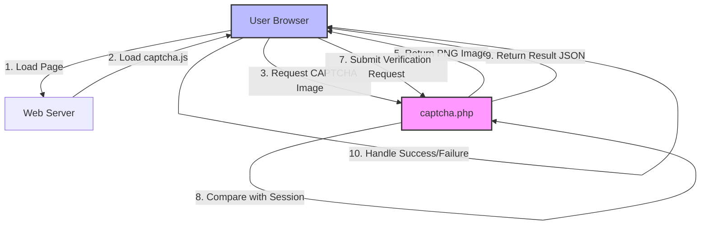
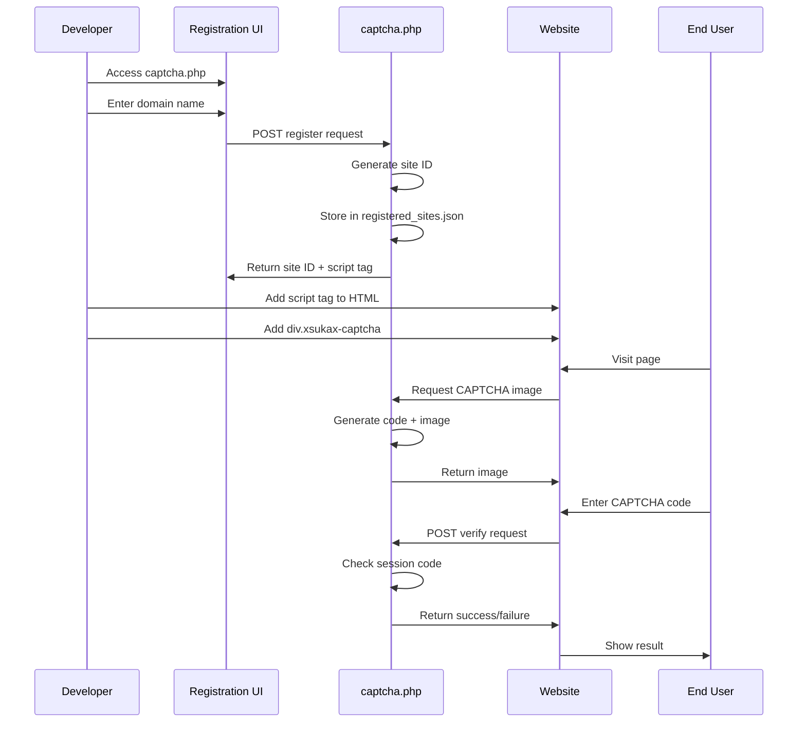
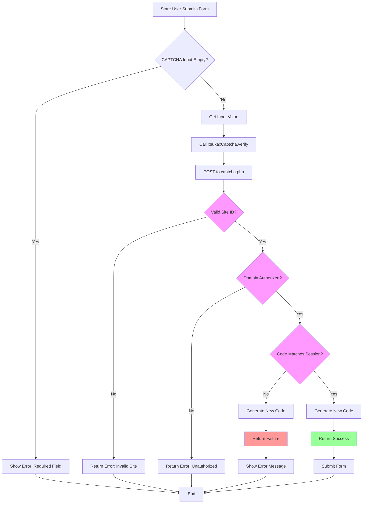

# xsukax PHP-JS CAPTCHA System

A lightweight, self-hosted CAPTCHA solution combining PHP backend API with vanilla JavaScript frontend library. This system provides essential bot protection for web forms without relying on external services or tracking user behavior.

## Project Overview

The xsukax PHP-JS CAPTCHA System is a privacy-focused, open-source CAPTCHA implementation designed for developers who require full control over their security infrastructure. The system consists of two primary components:

- **captcha.php**: A PHP-based backend API that handles site registration, CAPTCHA image generation, and verification processes
- **captcha.js**: A vanilla JavaScript client library that seamlessly integrates CAPTCHA widgets into web forms

This solution generates visual text-based CAPTCHA challenges using PHP's GD Library, stores verification codes in server-side sessions, and validates user responses through secure API endpoints. The system employs domain-based access control to ensure only authorized websites can utilize registered CAPTCHA instances.

## Security and Privacy Benefits

### Data Sovereignty
All CAPTCHA generation, storage, and verification occurs on your own infrastructure. No user interaction data, IP addresses, or behavioral metrics are transmitted to third-party services, ensuring complete data sovereignty and GDPR compliance.

### Domain-Based Access Control
The system implements strict domain verification by validating HTTP_REFERER and HTTP_ORIGIN headers against registered domains. This prevents unauthorized websites from exploiting your CAPTCHA endpoints and protects against cross-site abuse.

### Session-Based Security
CAPTCHA codes are stored exclusively in server-side PHP sessions with a unique session key per site ID. This approach prevents client-side code inspection attacks and ensures verification codes cannot be intercepted or predicted.

### Automatic Code Regeneration
After each verification attempt (successful or failed), the system automatically generates a new CAPTCHA code. This one-time-use pattern mitigates replay attacks and prevents code reuse vulnerabilities.

### Cryptographic Site ID Generation
Site identifiers are generated using SHA-256 hashing with a configurable salt, creating unpredictable and collision-resistant identifiers that cannot be easily forged or enumerated.

### No External Dependencies
The system operates entirely on your server without loading external scripts, fonts, or resources that could introduce supply chain vulnerabilities or enable tracking mechanisms.

### CORS Configuration
While CORS is enabled for legitimate API access, domain verification ensures that even with permissive CORS headers, only pre-registered domains can successfully utilize the CAPTCHA functionality.

## Features and Advantages

- **Zero External Dependencies**: No third-party services, CDNs, or external APIs required beyond standard PHP and JavaScript
- **Simple Integration**: Add a single script tag and a div element to enable CAPTCHA protection on any form
- **Self-Service Registration**: Built-in web interface allows domain registration and code generation without server configuration
- **Automatic Initialization**: JavaScript library auto-detects and renders CAPTCHA widgets on page load
- **Programmatic API**: Comprehensive JavaScript API for custom integration and advanced use cases
- **Refresh Functionality**: Users can generate new CAPTCHA images without page reload if text is unclear
- **Visual Distortion**: Implements line noise, pixel noise, and character positioning variance to prevent OCR attacks
- **Lightweight Architecture**: Minimal resource footprint with no database requirements (uses JSON file storage)
- **Responsive Design**: CAPTCHA widgets adapt to various screen sizes and form layouts
- **Multiple Site Support**: Single installation can serve CAPTCHA for multiple registered domains
- **Session Isolation**: Each site maintains independent session storage preventing cross-site interference
- **Case-Insensitive Input**: User input is automatically normalized to uppercase for improved usability

## Installation Instructions

### Prerequisites

- PHP 7.0 or higher
- PHP GD Library extension enabled
- Web server (Apache, Nginx, or similar) with PHP support
- Write permissions for session storage and JSON file creation

### Step 1: Verify PHP GD Library

Ensure the GD library is installed and enabled:

```bash
php -m | grep -i gd
```

If not installed, enable it in your `php.ini`:

```ini
extension=gd
```

### Step 2: Upload Files

Upload both files to your web server in the same directory:

```
/your-web-root/
  ├── captcha.php
  └── captcha.js
```

### Step 3: Configure Permissions

Ensure the directory has write permissions for session files and JSON storage:

```bash
chmod 755 captcha.php captcha.js
chmod 775 . # Directory needs write access
```

### Step 4: Configure Security Salt

**Important**: Edit `captcha.php` and change the default salt to a unique value:

```php
define('SALT', 'your-unique-secret-salt-change-this-value');
```

### Step 5: Access Registration Interface

Navigate to `captcha.php` in your browser:

```
https://yourdomain.com/path/to/captcha.php
```

You will see the registration interface where you can register domains.

### Step 6: Register Your Domain

1. Enter your domain name (e.g., `example.com`)
2. Click "Register & Generate Code"
3. Copy the generated script tag containing your unique site ID

### Step 7: Verify Installation

Check that `registered_sites.json` was created in the same directory:

```bash
ls -la registered_sites.json
cat registered_sites.json
```

## Usage Guide

### Basic Integration

#### HTML Setup

Add the CAPTCHA script to your HTML page and insert the widget container:

```html
<!DOCTYPE html>
<html>
<head>
    <title>Contact Form</title>
</head>
<body>
    <form id="contactForm">
        <label>Name:</label>
        <input type="text" name="name" required>
        
        <label>Email:</label>
        <input type="email" name="email" required>
        
        <label>Message:</label>
        <textarea name="message" required></textarea>
        
        <!-- CAPTCHA Widget -->
        <div class="xsukax-captcha"></div>
        
        <button type="submit">Submit</button>
    </form>
    
    <!-- Load CAPTCHA Library -->
    <script src="https://yourdomain.com/captcha.js?site=YOUR_SITE_ID"></script>
    
    <script>
        document.getElementById('contactForm').addEventListener('submit', function(e) {
            e.preventDefault();
            
            // Get CAPTCHA code entered by user
            const captchaCode = xsukaxCaptcha.getCaptchaValue();
            
            // Verify CAPTCHA
            xsukaxCaptcha.verify(captchaCode, function(result) {
                if (result.success) {
                    alert('CAPTCHA verified! Submitting form...');
                    // Proceed with form submission
                    e.target.submit();
                } else {
                    alert('Invalid CAPTCHA: ' + result.message);
                }
            });
        });
    </script>
</body>
</html>
```

### Advanced Integration

#### Manual Widget Rendering

```javascript
// Render CAPTCHA in a specific element
xsukaxCaptcha.render('custom-captcha-container');
```

#### Custom Verification Handling

```javascript
// Get CAPTCHA value
const code = xsukaxCaptcha.getCaptchaValue();

// Verify with custom callback
xsukaxCaptcha.verify(code, function(result) {
    if (result.success) {
        console.log('Verification successful');
        // Custom success handling
        submitFormData();
    } else {
        console.error('Verification failed:', result.message);
        // Custom error handling
        showErrorMessage(result.message);
    }
});
```

#### Programmatic Refresh

```javascript
// Refresh CAPTCHA image programmatically
const img = document.querySelector('.xsukax-captcha-widget img');
const siteId = xsukaxCaptcha.getSiteId();
const apiUrl = xsukaxCaptcha.getApiUrl();
img.src = `${apiUrl}?action=image&site=${siteId}&refresh=1&t=${Date.now()}`;
```

### JavaScript API Reference

The `xsukaxCaptcha` global object provides the following methods:

| Method | Parameters | Returns | Description |
|--------|-----------|---------|-------------|
| `render(elementId)` | elementId: string | void | Manually renders CAPTCHA widget in specified element |
| `verify(code, callback)` | code: string, callback: function | void | Verifies CAPTCHA code and executes callback with result |
| `getCaptchaValue()` | none | string | Returns current value from CAPTCHA input field |
| `getSiteId()` | none | string | Returns the registered site identifier |
| `getApiUrl()` | none | string | Returns the API endpoint URL |

### Backend PHP API Endpoints

#### Image Generation
```
GET captcha.php?action=image&site=SITE_ID&refresh=1
```

#### Site Registration
```
POST captcha.php
Form Data: action=register&domain=example.com
```

#### CAPTCHA Verification
```
POST captcha.php
Form Data: action=verify&site_id=SITE_ID&captcha_code=ABC123
```

#### Site Information
```
GET captcha.php?action=info&site=SITE_ID
```

### System Architecture



### Integration Flow



### Verification Process



## Troubleshooting

### CAPTCHA Image Not Displaying

**Issue**: Blank image or error image appears

**Solutions**:
- Verify PHP GD library is installed: `php -m | grep gd`
- Check file permissions on captcha.php
- Review PHP error logs for GD-related errors
- Ensure `session_start()` is called successfully

### Domain Verification Failures

**Issue**: "Unauthorized domain" error

**Solutions**:
- Verify domain in `registered_sites.json` matches exactly
- Check that HTTP_REFERER or HTTP_ORIGIN headers are being sent
- Remove `www.` prefix if inconsistent between registration and usage
- Verify subdomain registration if using subdomain

### Session Issues

**Issue**: CAPTCHA verification always fails

**Solutions**:
- Ensure cookies are enabled in browser
- Check session storage directory permissions
- Verify `session_start()` is called before any output
- Clear browser cookies and test again

### CORS Errors

**Issue**: Cross-origin request blocked

**Solutions**:
- Verify script is loaded from same origin as API
- Check that domain is properly registered
- Review browser console for specific CORS error messages

## Best Practices

1. **Change Default Salt**: Always modify the security salt in production
2. **Use HTTPS**: Deploy CAPTCHA over secure connections to prevent session hijacking
3. **Rate Limiting**: Implement server-side rate limiting for verification attempts
4. **Session Configuration**: Configure appropriate session timeout values
5. **Backup JSON File**: Regularly backup `registered_sites.json`
6. **Monitor Logs**: Review access logs for suspicious patterns
7. **Update Regularly**: Keep PHP and server software updated

## License

This project is licensed under the GNU General Public License v3.0.

---

**Repository**: [https://github.com/xsukax/xsukax-PHP-JS-CAPTCHA-System](https://github.com/xsukax/xsukax-PHP-JS-CAPTCHA-System)

**Issues & Support**: Please report bugs and feature requests via GitHub Issues.

**Contributions**: Pull requests are welcome. For major changes, please open an issue first to discuss proposed modifications.
