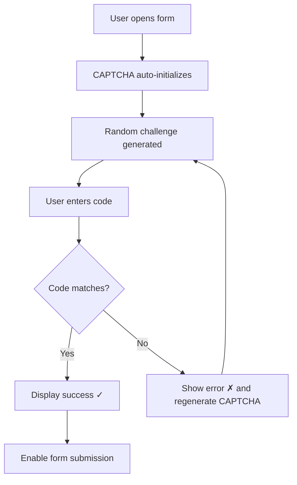

# xsukax JS CAPTCHA

**Demo:** [https://xsukax.github.io/xsukax-JS-CAPTCHA](https://xsukax.github.io/xsukax-JS-CAPTCHA)  
**Repository:** [https://github.com/xsukax/xsukax-JS-CAPTCHA](https://github.com/xsukax/xsukax-JS-CAPTCHA)

---

## 🧩 Project Overview

**xsukax JS CAPTCHA** is a lightweight, client-side CAPTCHA library designed to protect web forms from automated bot submissions without relying on any external APIs or dependencies. Built entirely in vanilla JavaScript and rendered via HTML5 Canvas, it provides secure, user-friendly visual verification challenges that seamlessly integrate into any HTML form.

The CAPTCHA is automatically initialized for every element with the class `.xsukax-captcha`, offering a plug-and-play experience suitable for developers who prioritize security, simplicity, and performance.

---

## 🔒 Security and Privacy Benefits

xsukax JS CAPTCHA is designed with **privacy and security at its core**, emphasizing transparency and user data protection:

- **No external dependencies or tracking** — all code runs locally in the browser; no user data is transmitted or stored remotely.
- **Canvas-rendered dynamic challenges** — each challenge is randomly generated using cryptographically secure random values via the Web Crypto API.
- **Rate-limiting and attempt control** — restricts failed attempts and enforces timeouts to mitigate brute-force attacks.
- **Auto-expiration and token-based validation** — generates unique verification tokens per challenge and ensures CAPTCHA validity only within a limited time window.
- **Tamper resistance** — dynamic rendering and random noise patterns make automated OCR attacks extremely difficult.
- **Form integration protection** — prevents form submission until CAPTCHA verification is successfully completed, safeguarding against scripted submissions.

These mechanisms collectively ensure that CAPTCHA verification is both **secure and privacy-friendly**, with **no personal data collection** or third-party dependencies.

---

## 🌟 Features and Advantages

- ✅ **Pure JavaScript** — no libraries or frameworks required.  
- 🎨 **Canvas-based rendering** — generates unique visual challenges with randomized text, colors, and distortion.  
- 🔐 **Secure random generation** — uses `crypto.getRandomValues()` for cryptographic security.  
- 🧠 **Smart verification logic** — supports multiple attempts and prevents expired submissions.  
- ⚙️ **Automatic initialization** — attaches CAPTCHA to any `.xsukax-captcha` container automatically.  
- 🕒 **Challenge expiration timer** — challenges expire after a defined timeout (default: 2 minutes).  
- 🪶 **Lightweight and fast** — minimal footprint, ideal for static sites or high-security forms.  
- 💬 **Accessible UX** — clear feedback messages and responsive design.  

---

## 🧰 Installation Instructions

You can integrate xsukax JS CAPTCHA into any webpage in **two simple steps**:

### 1. Include the CAPTCHA script
```html
<script src="https://xsukax.github.io/xsukax-JS-CAPTCHA/captcha.js"></script>
````

### 2. Add the CAPTCHA container to your form

```html
<form action="#" method="post">
  <input type="text" name="name" placeholder="Your name" required>
  <input type="email" name="email" placeholder="you@example.com" required>
  <div class="xsukax-captcha"></div>
  <button type="submit">Submit</button>
</form>
```

The CAPTCHA will initialize automatically on page load.

---

## 🚀 Usage Guide

Once installed, the CAPTCHA system requires no manual initialization. The script automatically detects and attaches CAPTCHA instances to all elements with the `.xsukax-captcha` class.

### Typical Workflow



### Verification and Form Submission

* Users must correctly enter the CAPTCHA code before form submission is permitted.
* After successful verification, a hidden input field containing a secure token (`xsukax_captcha_token`) is added to the form.
* Forms without successful CAPTCHA verification are automatically blocked from submission.

### Resetting CAPTCHA Manually

Developers can manually reset all CAPTCHA instances via:

```js
window.xsukaxCAPTCHA.resetAll();
```

---

## 📁 Project Structure

```
xsukax-JS-CAPTCHA/
├── index.html           # Demo page with form and CAPTCHA integration
├── captcha.js           # Core CAPTCHA library
└── README.md            # Project documentation
```

---

## ⚖️ Licensing Information

This project is licensed under the **GNU General Public License v3.0**.

---

**© 2025 xsukax — Open-source JavaScript CAPTCHA for secure, privacy-first web forms.**

```
```
