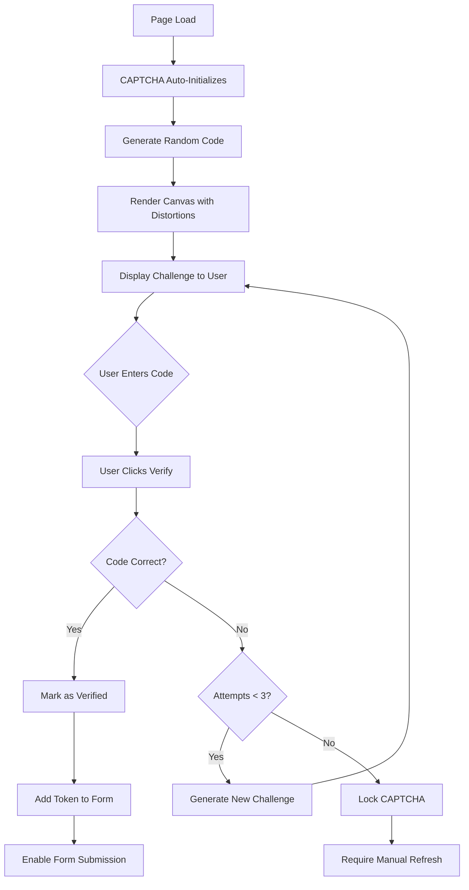
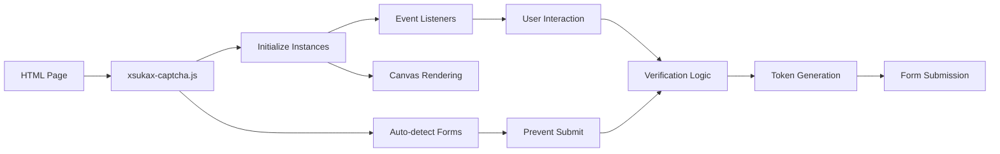
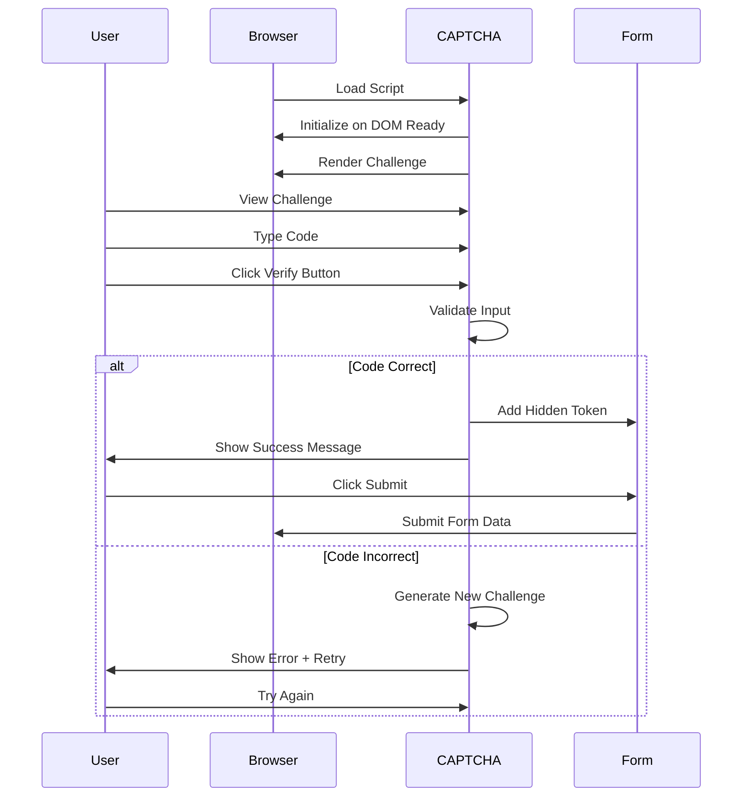

# xsukax JS CAPTCHA


A lightweight, secure, and privacy-focused JavaScript CAPTCHA solution designed to protect web forms from automated bot attacks without compromising user experience or requiring external services.

## 🔗 Quick Links

- **Live Demo**: [https://xsukax.github.io/xsukax-JS-CAPTCHA](https://xsukax.github.io/xsukax-JS-CAPTCHA)
- **CDN**: `https://xsukax.github.io/xsukax-JS-CAPTCHA/captcha.js`
- **Repository**: [https://github.com/xsukax/xsukax-JS-CAPTCHA](https://github.com/xsukax/xsukax-JS-CAPTCHA)

---

## 📋 Project Overview

**xsukax JS CAPTCHA** is a self-contained, client-side CAPTCHA implementation that provides robust bot protection for web applications. Unlike traditional CAPTCHA solutions that rely on third-party services, tracking cookies, or external APIs, xsukax CAPTCHA operates entirely within your web pages using pure JavaScript and HTML5 Canvas technology.

The solution generates visually distorted alphanumeric challenges that are easy for humans to read but difficult for automated systems to solve. It features automatic initialization, form integration, and a clean, modern interface that seamlessly adapts to any website design.

### Primary Capabilities

- **Canvas-Based Challenge Generation**: Creates dynamic, distorted text challenges using HTML5 Canvas API
- **Automatic Form Integration**: Detects and integrates with HTML forms without manual configuration
- **Zero External Dependencies**: No libraries, frameworks, or external services required
- **Responsive Design**: Adapts to desktop and mobile devices automatically
- **Session Management**: Implements token-based verification with time-limited challenges
- **Customizable Appearance**: Easily styled to match your website's design language

---

## 🔒 Security and Privacy Benefits

xsukax CAPTCHA prioritizes user privacy and data security through its architecture and implementation:

### Privacy-First Architecture

- **No Data Collection**: Zero user data is transmitted to external servers or third-party services
- **No Tracking**: No cookies, browser fingerprinting, or behavioral tracking mechanisms
- **Client-Side Processing**: All challenge generation and validation logic executes locally in the user's browser
- **No External Dependencies**: Eliminates supply chain security risks associated with third-party libraries

### Security Features

- **Challenge Randomization**: Each CAPTCHA generates unique alphanumeric codes using cryptographically secure random number generation
- **Visual Obfuscation**: Implements multiple layers of distortion including rotation, scaling, noise injection, and color variation to prevent OCR-based attacks
- **Time-Based Expiration**: Challenges automatically expire after 2 minutes, preventing replay attacks
- **Attempt Limiting**: Restricts users to 3 verification attempts per challenge, mitigating brute-force attacks
- **Token Generation**: Creates secure, unique tokens for each challenge using the Web Crypto API when available
- **Form Submission Protection**: Prevents form submission until CAPTCHA verification is successfully completed
- **Character Set Optimization**: Uses only non-ambiguous uppercase characters (excludes I, O, 0, 1) to reduce user frustration while maintaining security

### Anti-Automation Measures

- **Dynamic Canvas Rendering**: Each challenge is drawn with random variations in font styling, positioning, and effects
- **Multi-Layer Noise**: Combines pixel-level noise, line overlays, and gradient backgrounds to defeat simple image recognition
- **Character Distortion**: Applies random rotation, scaling, and vertical offset to individual characters
- **Session Isolation**: Each CAPTCHA instance maintains independent state, preventing cross-challenge attacks

---

## ✨ Features and Advantages

### Core Features

- **🚀 Zero Configuration**: Simply include the script and add a `<div>` element—no setup required
- **📦 Lightweight**: Under 25KB minified, ensuring minimal impact on page load times
- **🎨 Modern UI**: Clean, professional interface with smooth animations and visual feedback
- **♿ Accessibility**: Includes refresh functionality and clear status messages for improved usability
- **🔄 Auto-Refresh**: Users can generate new challenges instantly via click or dedicated refresh button
- **📱 Mobile Responsive**: Optimized for touch interfaces with appropriate sizing and interactions
- **🌐 Cross-Browser Compatible**: Works on all modern browsers including Chrome, Firefox, Safari, and Edge
- **⚡ Instant Feedback**: Real-time validation with clear success/error messaging

### Key Advantages

1. **Privacy Compliance**: Fully GDPR, CCPA, and privacy regulation compliant due to zero data collection
2. **No Recurring Costs**: Unlike reCAPTCHA or hCaptcha, there are no API fees or usage limits
3. **Complete Control**: Full ownership of the CAPTCHA logic and appearance
4. **Offline Capable**: Functions without internet connectivity (after initial page load)
5. **No User Accounts Required**: No need for Google accounts or third-party authentication
6. **Customizable**: Open-source code allows full customization to meet specific requirements
7. **Developer Friendly**: Clean, well-documented code with comprehensive inline comments

---

## 📥 Installation Instructions

### Method 1: CDN Integration (Recommended)

Add the following script tag to your HTML file before the closing `</body>` tag:

```html
<script src="https://xsukax.github.io/xsukax-JS-CAPTCHA/captcha.js"></script>
```

### Method 2: Self-Hosted

1. Download the `captcha.js` file from the repository:
   ```bash
   wget https://xsukax.github.io/xsukax-JS-CAPTCHA/captcha.js
   ```

2. Place the file in your project directory (e.g., `/js/captcha.js`)

3. Reference it in your HTML:
   ```html
   <script src="/js/captcha.js"></script>
   ```

### Method 3: npm/Package Manager

For projects using npm or yarn, you can download and manage the file manually:

```bash
# Create a vendor directory
mkdir -p public/vendor

# Download the file
curl -o public/vendor/xsukax-captcha.js https://xsukax.github.io/xsukax-JS-CAPTCHA/captcha.js
```

---

## 🚀 Usage Guide

### Basic Implementation

#### Step 1: Include the Script

Add the script to your HTML page:

```html
<!DOCTYPE html>
<html lang="en">
<head>
    <meta charset="UTF-8">
    <meta name="viewport" content="width=device-width, initial-scale=1.0">
    <title>Form with CAPTCHA</title>
</head>
<body>
    <!-- Your page content -->
    
    <script src="https://xsukax.github.io/xsukax-JS-CAPTCHA/captcha.js"></script>
</body>
</html>
```

#### Step 2: Add CAPTCHA Container

Insert a `<div>` element with the class `xsukax-captcha` inside your form:

```html
<form action="/submit" method="POST">
    <div>
        <label for="name">Name:</label>
        <input type="text" id="name" name="name" required>
    </div>
    
    <div>
        <label for="email">Email:</label>
        <input type="email" id="email" name="email" required>
    </div>
    
    <!-- CAPTCHA will be automatically inserted here -->
    <div class="xsukax-captcha"></div>
    
    <button type="submit">Submit</button>
</form>
```

#### Step 3: Automatic Initialization

The CAPTCHA automatically:
- Initializes when the DOM is ready
- Generates the first challenge
- Attaches to the parent form
- Prevents form submission until verified

### Complete Example

```html
<!DOCTYPE html>
<html lang="en">
<head>
    <meta charset="UTF-8">
    <meta name="viewport" content="width=device-width, initial-scale=1.0">
    <title>Contact Form with xsukax CAPTCHA</title>
    <style>
        body {
            font-family: Arial, sans-serif;
            max-width: 500px;
            margin: 50px auto;
            padding: 20px;
        }
        form {
            background: #f8f9fa;
            padding: 30px;
            border-radius: 8px;
            box-shadow: 0 2px 10px rgba(0,0,0,0.1);
        }
        .form-group {
            margin-bottom: 15px;
        }
        label {
            display: block;
            margin-bottom: 5px;
            font-weight: 600;
        }
        input[type="text"],
        input[type="email"],
        textarea {
            width: 100%;
            padding: 8px 12px;
            border: 1px solid #ddd;
            border-radius: 4px;
            font-size: 14px;
        }
        button {
            background: #2c3e50;
            color: white;
            padding: 10px 20px;
            border: none;
            border-radius: 4px;
            cursor: pointer;
            font-size: 16px;
            width: 100%;
        }
        button:hover {
            background: #1a2530;
        }
    </style>
</head>
<body>
    <form action="/contact" method="POST">
        <h2>Contact Us</h2>
        
        <div class="form-group">
            <label for="name">Full Name</label>
            <input type="text" id="name" name="name" required>
        </div>
        
        <div class="form-group">
            <label for="email">Email Address</label>
            <input type="email" id="email" name="email" required>
        </div>
        
        <div class="form-group">
            <label for="message">Message</label>
            <textarea id="message" name="message" rows="4" required></textarea>
        </div>
        
        <!-- CAPTCHA Component -->
        <div class="xsukax-captcha"></div>
        
        <button type="submit">Send Message</button>
    </form>
    
    <script src="https://xsukax.github.io/xsukax-JS-CAPTCHA/captcha.js"></script>
</body>
</html>
```

### Advanced Usage

#### Multiple CAPTCHAs on One Page

You can include multiple CAPTCHA instances by adding multiple container elements:

```html
<form id="form1">
    <!-- Form fields -->
    <div class="xsukax-captcha"></div>
    <button type="submit">Submit Form 1</button>
</form>

<form id="form2">
    <!-- Form fields -->
    <div class="xsukax-captcha"></div>
    <button type="submit">Submit Form 2</button>
</form>
```

#### Programmatic Control

Access CAPTCHA instances programmatically using the global API:

```javascript
// Reset all CAPTCHAs on the page
window.xsukaxCAPTCHA.resetAll();

// Check if a specific CAPTCHA is verified
const isVerified = window.xsukaxCAPTCHA.isVerified('xsukax-captcha-123');

// Get instance details
const instance = window.xsukaxCAPTCHA.getInstance('xsukax-captcha-123');
console.log(instance.verified); // true or false
```

#### Custom Container IDs

Assign custom IDs to CAPTCHA containers for easier programmatic access:

```html
<div id="my-captcha" class="xsukax-captcha"></div>

<script>
    // Later in your code
    const captchaVerified = window.xsukaxCAPTCHA.isVerified('my-captcha');
</script>
```

### Server-Side Validation

When the form is submitted, a hidden field `xsukax_captcha_token` is automatically added:

```html
<!-- This field is automatically inserted upon successful verification -->
<input type="hidden" name="xsukax_captcha_token" value="[unique-token]">
```

**Important**: xsukax CAPTCHA is a client-side solution. For production environments, implement additional server-side validation such as:
- Rate limiting by IP address
- Honeypot fields
- Server-side token verification
- Request timing analysis

### Workflow Diagram



### Integration Architecture



---

## 🎯 User Interaction Flow



---

## 🛠️ Configuration Options

The CAPTCHA includes sensible defaults that can be modified by editing the `CONFIG` object in `captcha.js`:

```javascript
const CONFIG = {
    canvasWidth: 280,           // Canvas width in pixels
    canvasHeight: 80,           // Canvas height in pixels
    codeLength: 6,              // Number of characters in challenge
    challengeTimeout: 120000,   // Expiration time in milliseconds (2 min)
    maxAttempts: 3,             // Maximum verification attempts
    tokenLength: 32,            // Security token length
    characters: 'ABCDEFGHJKLMNPQRSTUVWXYZ23456789' // Character set
};
```

---

## 🌐 Browser Compatibility

| Browser | Minimum Version | Notes |
|---------|----------------|-------|
| Chrome | 90+ | Full support |
| Firefox | 88+ | Full support |
| Safari | 14+ | Full support |
| Edge | 90+ | Full support |
| Opera | 76+ | Full support |
| Mobile Safari | iOS 14+ | Full support |
| Chrome Mobile | 90+ | Full support |

**Requirements**: 
- JavaScript must be enabled
- HTML5 Canvas API support
- ES6+ JavaScript support

---

## 📊 Technical Specifications

- **File Size**: ~23KB (unminified), ~13KB (minified)
- **Performance**: <50ms initialization time
- **Memory Usage**: ~2MB per instance
- **Dependencies**: None
- **License**: GNU General Public License v3.0

---

## 🤝 Contributing

Contributions are welcome! Please feel free to submit pull requests, create issues, or suggest improvements.

### Development Setup

1. Clone the repository:
   ```bash
   git clone https://github.com/xsukax/xsukax-JS-CAPTCHA.git
   cd xsukax-JS-CAPTCHA
   ```

2. Open `index.html` in your browser to test changes

3. Make your modifications to `captcha.js`

4. Test across multiple browsers and devices

5. Submit a pull request with a clear description of changes

---

## 📄 License

This project is licensed under the GNU General Public License v3.0.

---

## 💬 Support

For issues, questions, or feature requests, please visit the [GitHub Issues](https://github.com/xsukax/xsukax-JS-CAPTCHA/issues) page.

---

## 🙏 Acknowledgments

Built with a focus on privacy, security, and user experience for the open-source community.

---

**Note**: While xsukax CAPTCHA provides effective protection against automated bots, no CAPTCHA system is 100% foolproof. For high-security applications, combine this solution with server-side validation, rate limiting, and additional security measures.
